# Create oData Services

1 - Access T-code SEGW

a.

b.

2 - After you create will generate this two entity types

a.

3 - In this case we gonna import from DDIC -> EKKO and EKPO 

a.

b.

c. Select the fields which you want to use

d. Select the keys

e. Do the same for EKPO

f.

g.

3 - Generate

a.

4 - after generating your odata service two new classes will be available

a. ABAP code should always be in DPC class.

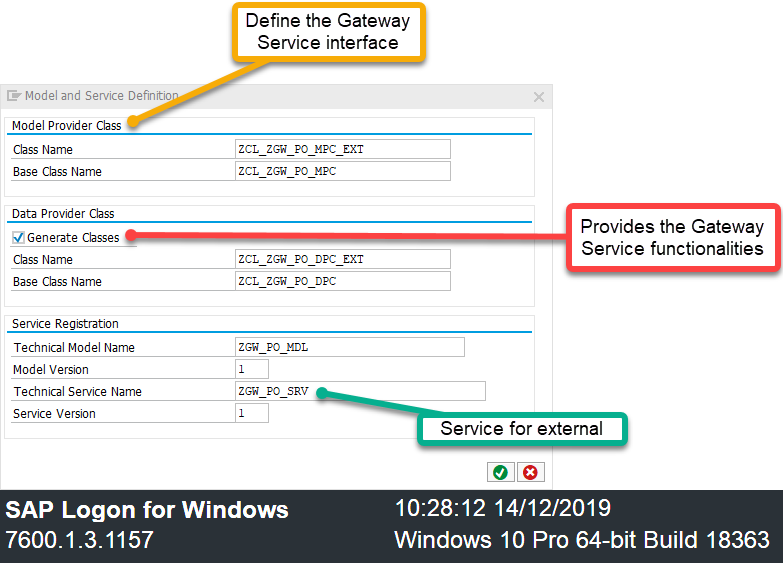

5 - Register your service in the gateway. (If your system is not embedded, this part will be different)

a.

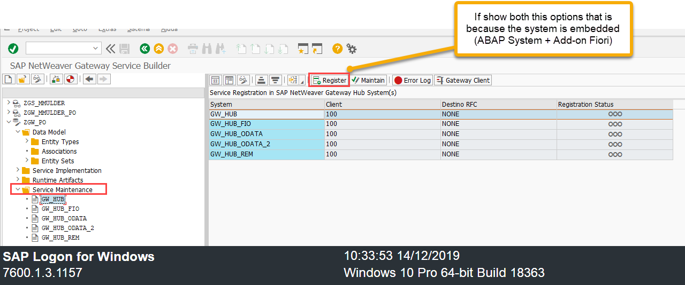

b.

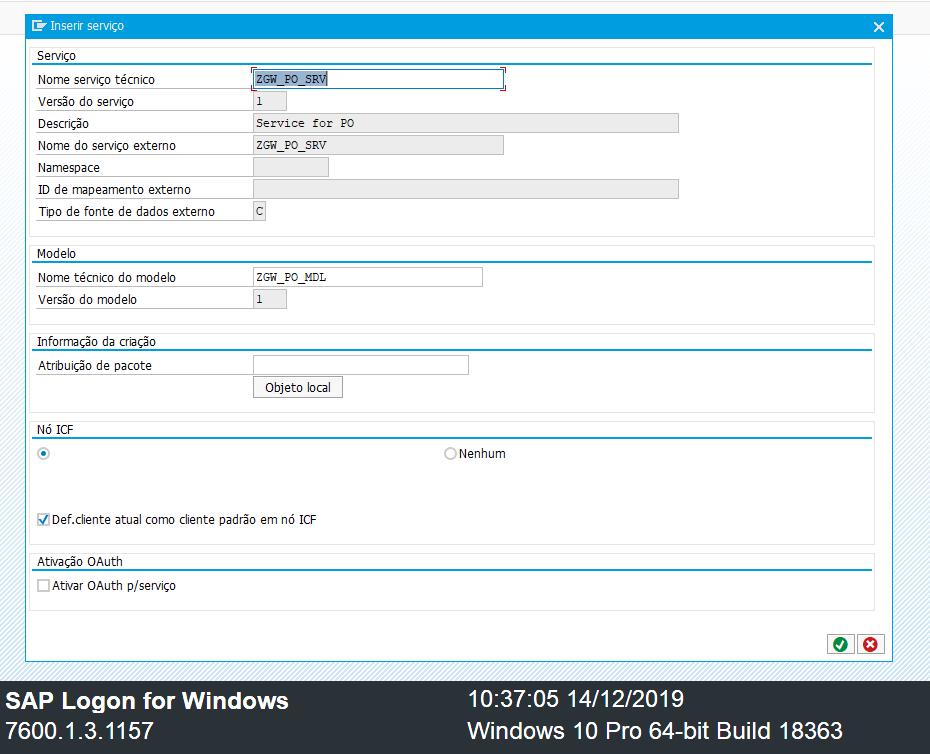

6 - Maitain to check status/infos

a.

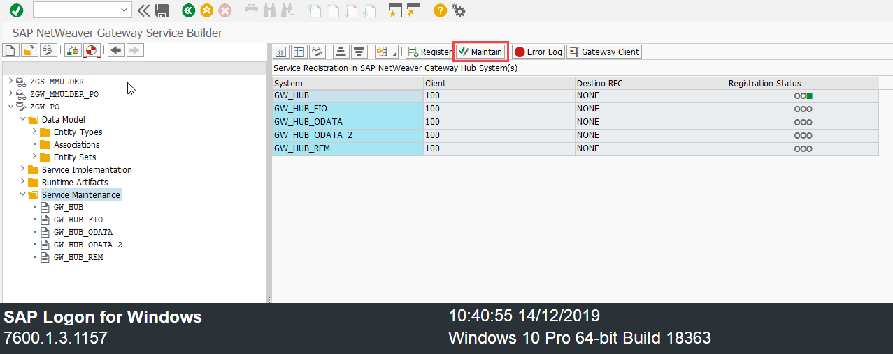

b.

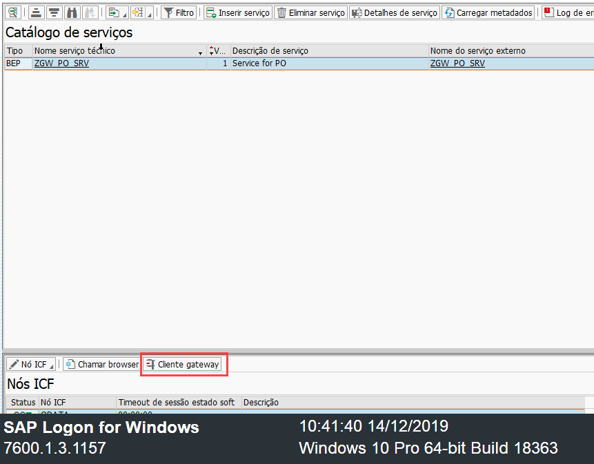

c.Congrats! Your service is available.

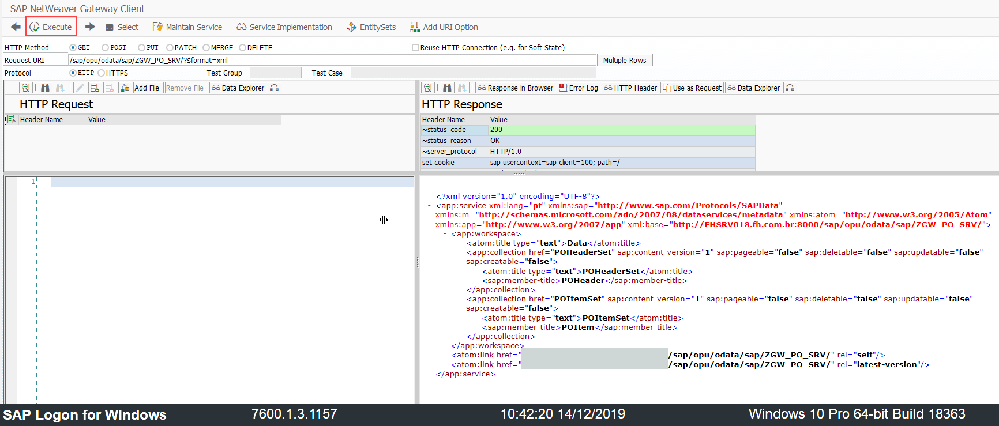

d. Try using json format for better viewing

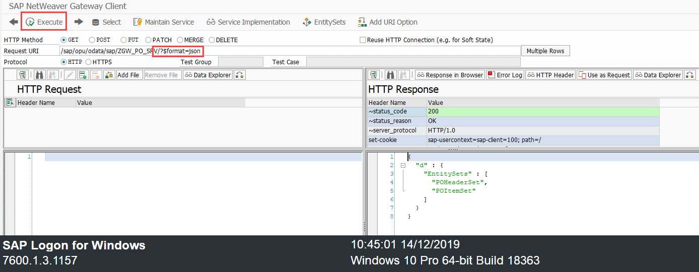

e. Check your metadata (Pay attention to this, very important to check the details of oData Service)

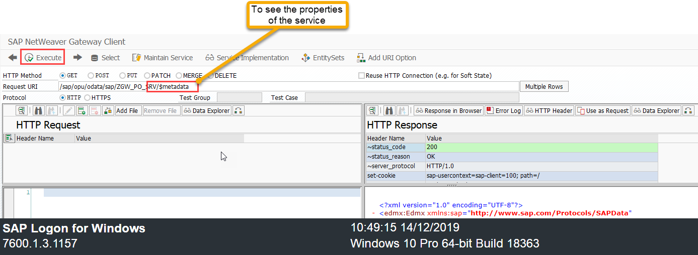

f. Copy this link and paste in your browser

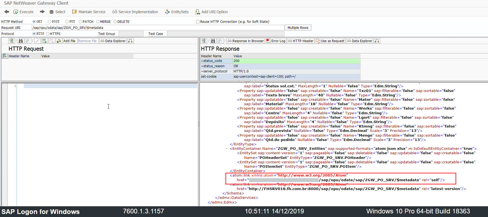

g.

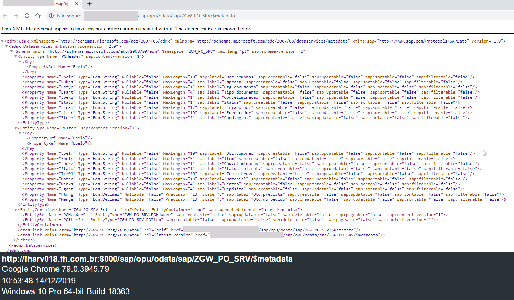

h.

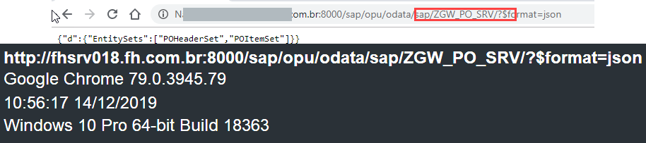

7 - Lets try get some data from your service

a.

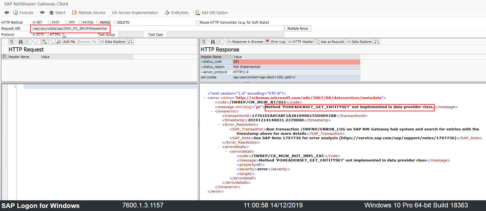

8 - Implement your service class

a.

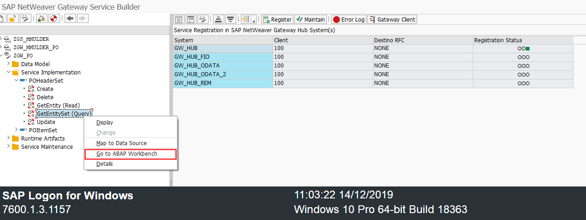

b. Select the method and click in the redefinition button

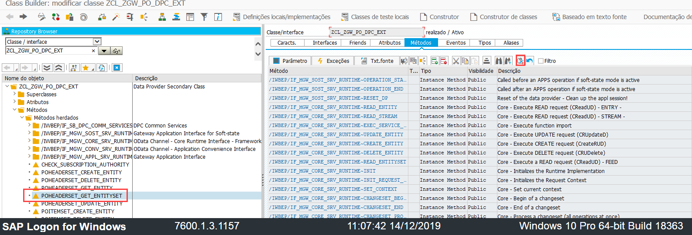

c. Example code used in this tutorial:

SELECT * UP TO 10 ROWS FROM ekko INTO CORRESPONDING FIELDS OF TABLE et_entityset.

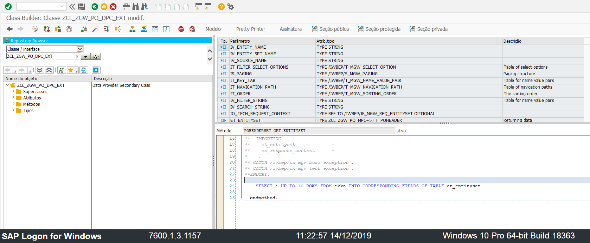

Save and Active the code.

9 - Now check the folder redefinition:

a.

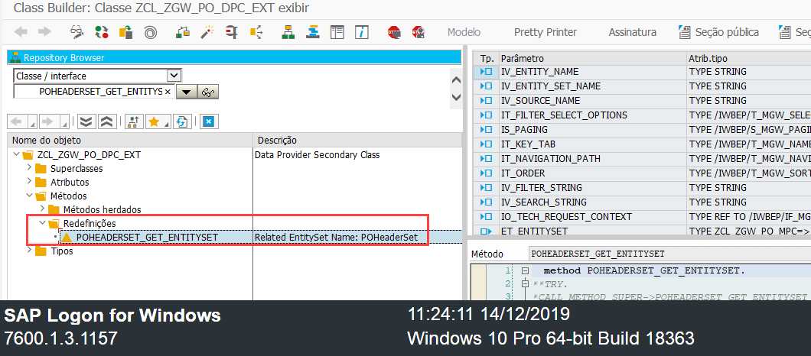

10 - Test again in the gateway POHeaderSet

a.

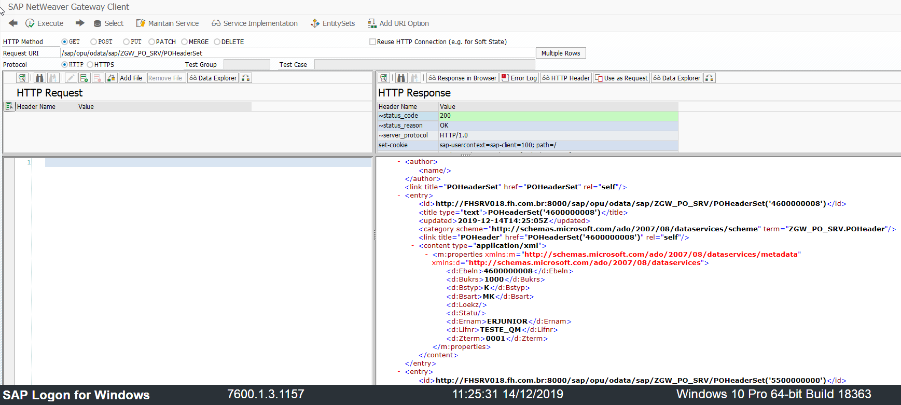

11 - Nice! Check in the browser and gateway with json format.

a.

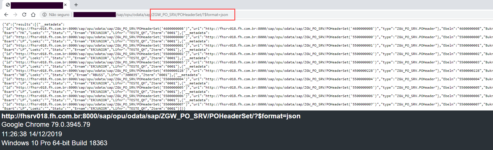

b.

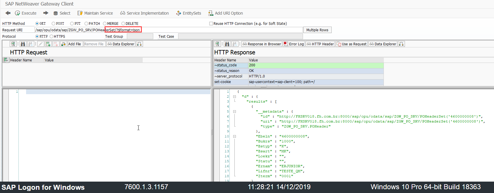

