# Create oData Services

1 - Access T-code SEGW

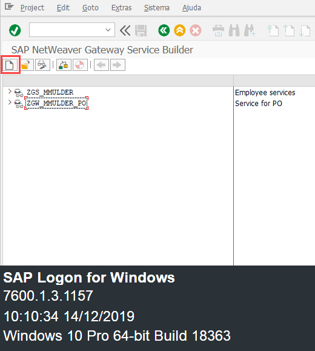

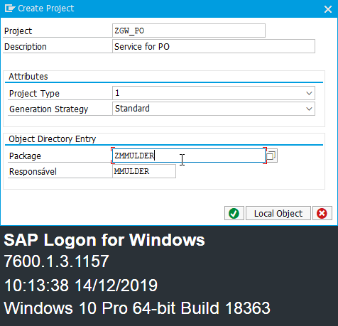

2 - After you create will generate this two entity types

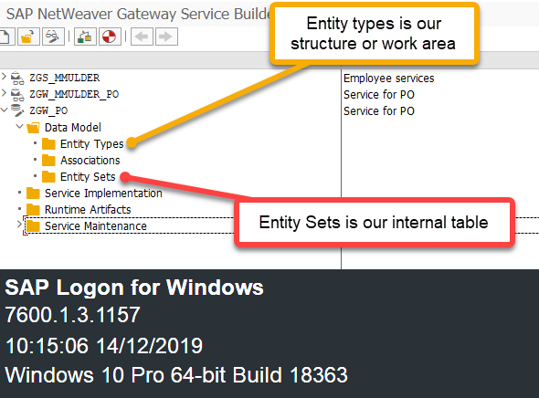

3 - In this case we gonna import from DDIC -> EKKO and EKPO 

a.
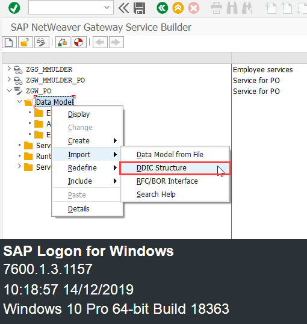

b.
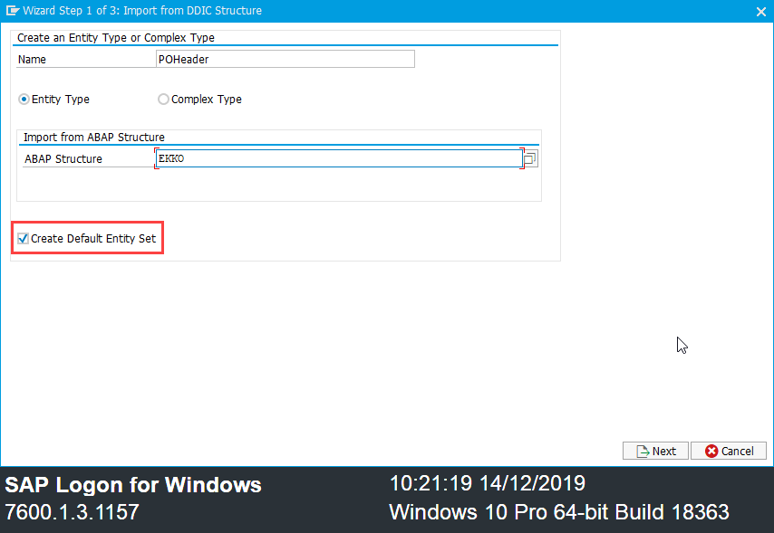

c. Select the fields which you want to use
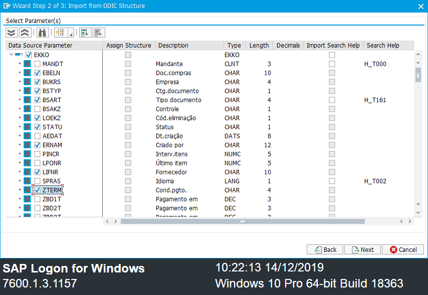

d. Select the keys
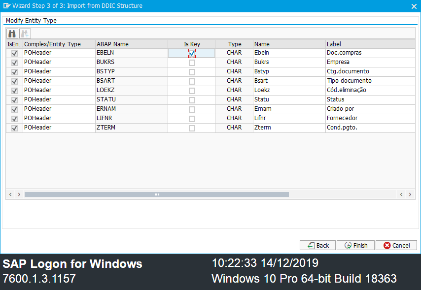

e. Do the same for EKPO
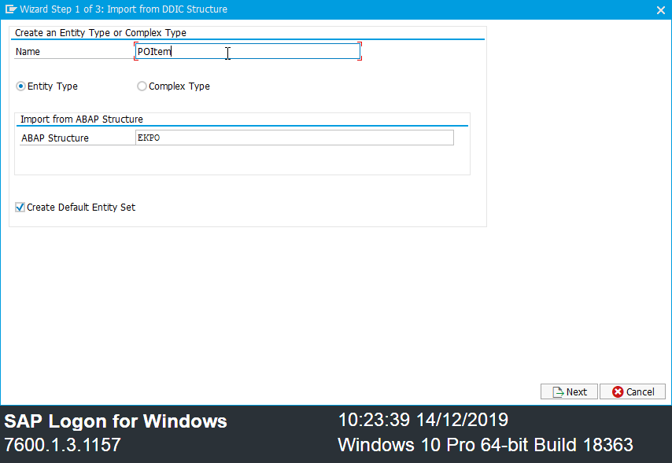

f.
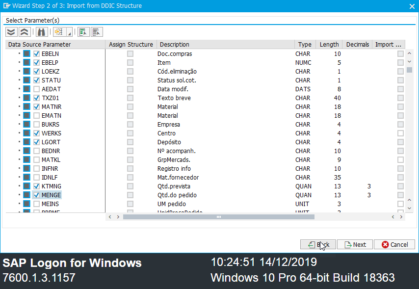

g.
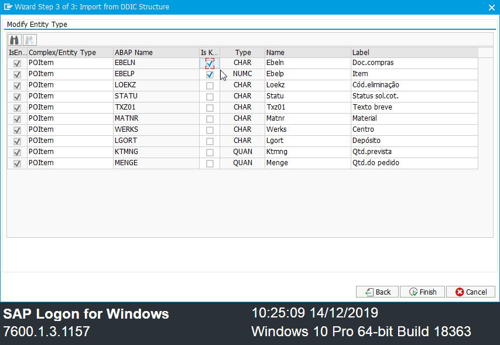

3 - Re-generate
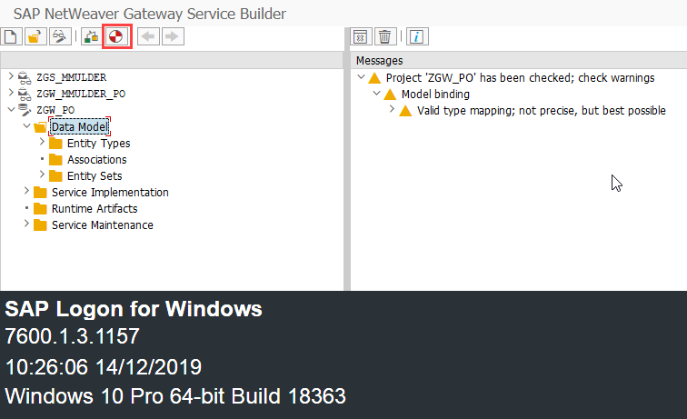
